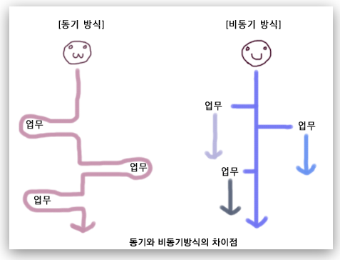
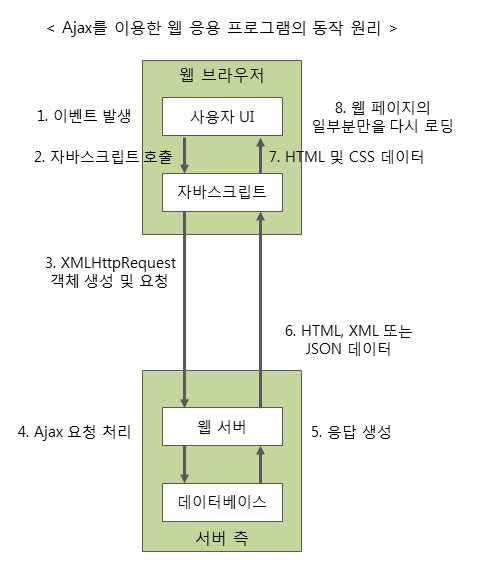
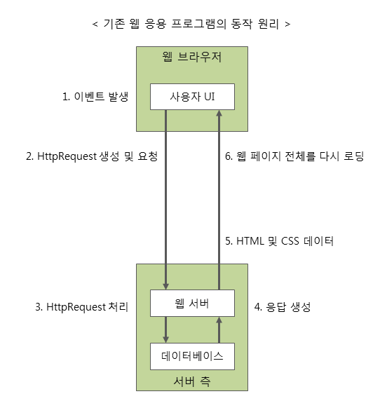

# AJAX

:writing_hand: *Assembled by Yunju Jang*

🤝*Contributors : JeongHea Shin, JiYe Bae*

## AJAX

- <b>AJAX 란?</b>
  - Asynchronous Javascript And XML (비동기식 자바스크립트와 XML)
  - 자바스크립트를 사용한 비동기 통신, 클라이언트와 서버 간에 다양한 데이터 (JSON, XML, HTML, 텍스트 파일 등) 를 주고 받는 기술이다.
  - 빠르게 동작하는 동적인 웹 페이지를 만들기 위한 개발 기법의 하나이다.
    - 브라우저가 갖고 있는 XMLHttpRequest 객체를 이용하여 전체 페이지를 새로 고치지 않고도 페이지의 일부분만을 위한 데이터를 로드하는 기법이다.

 

 

- <b>AJAX의 특징</b>

  - 비동기 방식
    - 페이지를 리로드하지 않고 데이터를 불러온다.

    - 즉, AJAX를 통해 서버에 요청을 한 후 멈춰 있는 것이 아니라, 프로그램은 계속 돌아간다.

      

   

  - 페이지 새로 고침 없이, 일부만 갱신 가능하다.
    - XMLHttpRequest 객체를 통해 서버에 request하여 일부분만 갱신 가능하다.
    - JSON이나 XML 형태로 필요한 데이터만 받아 갱신하기 때문에 그만큼의 자원과 시간을 절약할 수 있다.

 

 

- <b>AJAX 장단점</b>

  - <b>장점</b>

    - 웹페이지 속도 향상
    - 서버의 처리가 완료될 때까지 기다리지 않고 처리 가능하다.
    - 서버에서 데이터만 전송하면 되므로 전체적인 코딩의 양이 줄어든다.
      - 전체 페이지를 보내지 않고 요청에 맞는 값만 보내면 된다.
    - 기존 웹에서 불가능했던 다양한 UI를 가능하게 한다.
      - Flickr(미국 사진 공유 커뮤니티)의 경우, 사진의 제목이나 태그를 페이지 리로드 없이 수정 가능하다.

     

  - <b>단점</b>

    - 히스토리가 관리되지 않는다.

    - 페이지 이동 없는 통신이므로 보안상의 문제가 생길 수 있다.

    - 연속적으로 데이터를 요청하면 서버 부하가 증가할 수 있다.

    - XMLHttpRequest를 통해 통신하는 경우, 사용자에게 아무런 진행 정보가 주어지지 않는다.

      - 따라서, 요청이 완료되지 않았는데 사용자가 페이지를 떠나거나 오작동할 우려가 발생한다.

    - AJAX를 쓸 수 없는 브라우저에 대한 문제 이슈가 있다.

    - AJAX는 클라이언트가 서버에 데이터를 요청하는 '클라이언트 풀링 방식'을 사용하므로, 서버 푸시 방식의 실시간 서비스는 만들 수 없다.

      > 클라이언트 풀링 방식
      >
      > - 사용자가 직접 원하는 정보를 서버에게 요청하여 얻는 방식
      >
      >  
      >
      > 서버 푸시 방식
      >
      > - 사용자가 요청하지 않아도 서버가 자동으로 특정 정보를 제공하는 것

    - 동일-출처 정책으로 인해 다른 도메인과 통신이 불가능하다.

      > 동일 - 출처 정책
      >
      > - 어떤 출처에서 불러온 문서나 스크립트가 다른 출처에서 가져온 리소스와 상호작용하는 것을 제한하는 보안 방식

    - 바이너리 데이터를 보내거나 받을 수 없다.

     

 

- <b>AJAX 구성요소</b>
  - AJAX는 기존에 사용되던 여러 기술을 함께 사용하여 이루어진다.
    - 웹 페이지 표현 - HTML, CSS
    - 데이터 접근이나 화면 구성의 동적 조작 - DOM 모델
    - 데이터의 교환 - JSON, XML
    - 웹 서버와 비동기식 통신 - XMLHttpRequest 객체
    - 위의 기술들을 결합하여 사용자의 작업 흐름을 제어 - 자바스크립트

 

 

- <b>AJAX를 이용한 웹 응용 프로그램의 동작 원리</b>

  - AJAX의 동작은 AJAX 구성 요소들을 사용하여 이루어진다.

  - AJAX vs 기존 웹

    

    

    - 사용자에 의한 요청 이벤트가 발생한다.
    - 이벤트 핸들러에 의해 자바스크립트가 호출된다.
    - 자바스크립트는 XMLHttpRequest 객체를 사용하여 서버로 요청한다.
      - 이때, 웹 브라우저는 요청을 보내고 나서 서버의 응답을 기다릴 필요 없이 다른 작업을 처리할 수 있다.
      - 하지만, open에서 false를 할 경우, 동기식이 되어 응답을 기다려야 한다.
    - 서버는 전달 받은 XMLHttpRequest 객체를 가지고 AJAX 요청을 처리한다.
    - 서버는 처리 결과를 HTML, XML 또는 JSON 형태의 데이터로 웹 브라우저에 전달한다.
      - 이 때 전달되는 응답은 새로운 페이지를 전부 내보내는 것이 아닌, 필요한 데이터만을 전달한다.
    - 서버로 부터 전달 받은 데이터를 가지고 웹 페이지의 일부분만을 갱신하는 자바스크립트를 호출한다.
    - 결과적으로 웹 페이지의 일부분만이 다시 로딩되어 표시된다.

    

 

## 예상질문❔

Q1) AJAX란 무엇인가?

A1) 전체 페이지를 새로 고치지 않고도 페이지의 일부만을 위한 데이터를 로드하는 비동기식 데이터 전송 기술이다.

 

Q2) 비동기 방식이란 무엇인가?

A2) 요청을 보낸 후 응답과는 상관 없이 다음 동작을 진행하는 방식이다.

 

 

### Reference📖

- https://github.com/fake-developers/1st/blob/main/SJH/AJAX.md