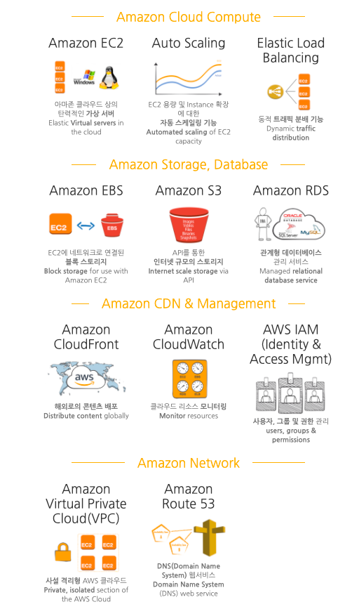

# AWS

:writing_hand: *Assembled by Yunju Jang*

🤝*Contributors : JiYoung-Kwon*

#### +) 참고 

- <b>클라우드 컴퓨팅 (Cloud computing) 이란?</b>

  - 쉬운 의미로 서버 가상화 기술이다.

  - 인터넷을 통해 IT 리소스와 애플리케이션을 \*온디맨드로 제공하는 서비스, 즉 종량 과금제이다.

    - 유저가 직접 서버를 구입하고 설치할 필요 없이, AWS 상에서 클릭 몇 번으로 서버를 구축하고 사용할 수 있다.

    > 온디맨드 서비스
    >
    > - 내가 있는 곳으로 상품이나 서비스가 찾아오는 것을 뜻한다.

  - 기존의 물질적인 형태의 실물 컴퓨팅 리소스를 네트워크 기반 서비스 형태로 제공하는 것이다.

  - 사용자로 하여금 네트워크 상에서 클라우드 서비스의 자원을 사용하는 것을 의미한다.

     

  > 온프레미스 (On-premise)
  >
  > - 기업의 서버를 클라우드 같은 원격 환경에서 운영하는 방식이 아닌, 자체적으로 보유한 전산실에 직접 설치해 운영하는 방식을 의미한다.
  > - 클라우드 컴퓨팅 기술이 나오기 전까지 기업 인프라 구축의 일반적인 방식이다.
  > - 기업의 비즈니스 정보를 보안성 높게 관리할 수 있으나, 구축하는 데 시간과 비용이 많이 든다.

   

   

- <b>클라우드 컴퓨팅의 분류</b>

  - <b>IaaS (Infrastructure as a Service)</b>
    - <mark>AWS</mark>, 네이버 플랫폼과 같은 인프라스트럭쳐를 제공하는 서비스이다.
    - 가상 서버 또는 스토리지, 가상 네트워크 등의 리소스를 서비스 형태로 제공한다.
    - 사용자는 물리적인 하드웨어를 직접 관리할 필요가 없으며, 직접적으로 서비스 이용을 통해 컴퓨터 리소스를 사용할 수 있다.
    - 클라우드 IT의 기본 구성 요소는 네트워킹, 컴퓨터, 데이터 스토리지 공간이다.

   

  - <b>PaaS (Platform as a Service)</b>
    - DB 또는 애플리케이션 서버 등의 이미 미들웨어를 제공한다.
    - 하드웨어, OS, 미들웨어에 대한 관리는 서비스 제공자가 하며, 사용자는 제공된 미들웨어만 사용할 수 있다.
    - 주로 개발 환경과 관련한 서비스를 제공한다. (OS, DB, WAS, JDK)
    - 기본 인프라를 관리할 필요 없이 애플리케이션을 실행할 수 있게 해준다.

   

  - <b>SaaS (Software as a Service)</b>
    - 소프트웨어 또는 애플리케이션의 기능만 제공한다.
    - 네이버 클라우드, 웹 메일, ERP 등과 같은 형태의 서비스를 사용자에게 제공한다.

  

 

 

 

## AWS (Amazon Web Service)

- <b>AWS 란?</b>

  - 아마존닷컴에서 개발한 클라우드 컴퓨팅 플랫폼이다.

  - 네트워킹을 기반으로 가상 컴퓨터와 스토리지, 네트워크 인프라 등 다양한 서비스를 제공하고 있다.

  - 비즈니스와 개발자가 웹 서비스를 사용하여 확장 가능하고 정교한 애플리케이션을 구축하도록 지원한다.

    - 손쉽게 클라우드로 서버를 구축할 수 있고, 개발자가 신경 써야할 많은 부분을 AWS가 해결해준다.

    > - 

  - 현재 소규모 법인(회사) 및 개인을 포함한 다양한 사용자들이 사용하고 있으며, 클라우드 컴퓨팅의 장점을 이용하기 위해 많은 거대 기업에서도 활용하고 있다.

 

 

- <b>AWS 클라우드 컴퓨팅의 장점</b>

  - 저렴한 비용
    - 사전 확약금이나 장기 약정 없이 저렴한 종량 과금제 방식으로 운영된다.
    - 확장형 글로벌 인프라를 구축 및 관리하고, 더 저렴한 요금의 형태로 사용자에게 비용 절감 혜택을 고스란히 돌려준다.
    - 자본 비용을 가변 비용으로 대체하여 시간대별로도 자원을 끌 수 있다.

   

  - 속도 및 민첩성 개선
    - 데이터 센터 운영 및 유지 관리에 비용을 투자할 필요 없다.
    - 몇 분만에 전세계에 배포가 가능하다.
    - 언어 및 운영 체제에 구애받지 않기 때문에 사용자의 비즈니스에 가장 적합한 개발 플랫폼 또는 프로그래밍 모델을 선택할 수 있다.
    - 사용할 서비스를 한 개 또는 여러개 선택하고, 그 사용 방식도 선택할 수 있다.

   

  - 민첩성, 즉각적 융통성
    - 서버 구축을 기다리는 대신 즉시 새로운 앱을 배포하고, 수요를 기준으로 축소가 가능하다.
    - 필요한 가상 서버의 대수에 상관 없이 가상 서버가 필요한 시간이 몇 시간이든 사용한 양만큼 비용이 청구된다.
    - 즉, 설치가 빠르고 관리가 간편하다.

 

 

- <b>AWS 필수 개념</b>

  \* AWS의 기초 서비스는 컴퓨팅, 네트워킹, 스토리지, 관리 도구로 나눌 수 있다.

  \* AWS가 제공하는 기능들은 굉장히 방대하나, 그 중 일반적으로 많이 사용되는 개념과 기능들은 다음과 같다.

  

  - <b>EC2 (Elastic Compute Cloud)</b>

    - AWS 상에서 사용하는 서버, EC2 서버에 API를 배포하게 된다.
    - EC2는 다양한 사양 옵션을 제공하므로, 필요한 사양의 EC2 인스턴스를 선택해서 사용하면 된다. (사양이 높을 수록 가격도 높다.)

     

  - <b>Security Group</b>

    - EC2 인스턴스에 대한 네트워킄 트래픽을 제어하는 가상 방화벽 역할을 한다.
    - 즉, security group 설정을 해주어야 EC2 인스턴스에 HTTP와 SSH 접속이 가능하다.

     

  - <b>RDB (Relational Database Service)</b>

    - AWS의 데이터베이스 서비스
    - RDS를 사용하면 사용자가 직접 서버를 생성해서 데이터 베이스를 설치하고, 설정하고, 관리하지 않아도 된다.
    - 사용자가 직접 데이터베이스를 설치하고 운영하는 것보다 RDS를 사용하는 것이 더 저렴하다.

     

  - <b>Route 53</b>

    - AWS의 DNS 서비스이다.

      > DNS
      >
      > - domain name system
      > - 숫자로 되어 있는 IP 주소로 해석해주는 TCP/IP 네트워크 서비스
      > - 인터넷에서 컴퓨터가 이것을 찾기 위해서는 숫자로 된 IP 주소가 필요하다.
      > - 호스트 서버가 인식할 수 있는 IP로 변환되면서 접속이 가능해진다.

    - API 시스템을 실제 도메인과 연결 시켜주는 기능을 제공한다.

     

  - <b>AWS S3 (Simple Storage Service)</b>

    - 파일을 쉽게 저장할 수 있는 공간을 제공하는 서비스
    - 파일을 저장하고, 파일마다 고유 주소를 부여하여 S3에 저장한 파일을 웹상에서 쉽게 읽어 올 수 있다.
    - 주로 사이트상의 이미지들을 저장하고 사이트에서 읽어들여 렌더링 해주는데 사용한다.

 

 

 

## 예상질문❔

Q1) AWS란 무엇인가?

A1) 아마존에서 제공하는 클라우드 컴퓨팅 서비스이다. 네트워킹을 기반으로 가상 컴퓨터와 스토리지, 네트워크 인프라 등 다양한 서비스를 제공하고 있다.

 

Q2) 클라우드 컴퓨팅이란 무엇인가?

A2) 인터넷을 통해 IT 리소스와 애플리케이션을 \*온디맨드로 제공하는 서비스, 즉 종량 과금제이다.

 

 

### Reference📖

- https://goddaehee.tistory.com/174
- https://yslab.kr/63
- https://m.blog.naver.com/PostView.nhn?blogId=dktmrorl&logNo=221745088983&proxyReferer=https:%2F%2Fwww.google.com%2F
- https://ooeunz.tistory.com/34
- https://velog.io/@wind1992/AWS%EB%9E%80