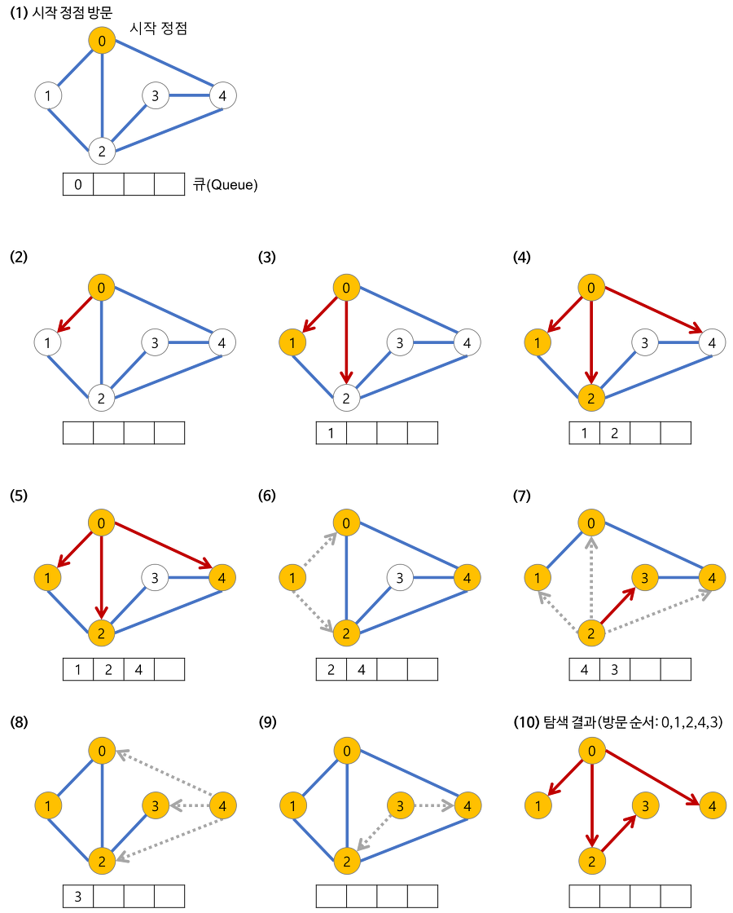

# 깊이 우선 탐색 (DFS) 와 너비 우선 탐색 (BFS)

:writing_hand: *Assembled by Yunju Jang*

🤝*Contributors : JeongHea Shin, JiYe Bae*

##### +) 참고

- <b>그래프란 ? </b>
  - 정점 (node) 와 그들을 연결하는 간선 (edge)로 이루어진 자료 구조의 일종
  - 그래프 탐색은 하나의 정점으로부터 차례대로 모든 정점들을 한 번씩 방문하는 것이다.
    - ex) 특정 도시에서 다른 도시로 갈 수 있는지, 전자 회로에서 특정 단자끼리 서로 연결되어 있는지 등

 

 

## 깊이 우선 탐색 (DFS)

- <b>DFS 란?</b>
  
  - Depth-First Search, 깊이 우선 탐색
  
  - 최대한 깊이 내려간 뒤, 더이상 깊이 갈 곳이 없을 경우 옆으로 이동한다.
  
    

 

 

- <b>DFS의 개념</b>
- 루트 노드 (혹은 다른 임의의 노드) 에서 시작해서 다음 분기 (branch)로 넘어가기 전, 해당 분기를 완벽하게 탐색하는 방식이다.
    - 미로찾기에서 최대한 한 방향으로 쭉 가다가, 더 이상 갈 수 없게 되면 다시 가장 가까운 갈림길로 돌아온다.
    - 그 갈림길부터 다시 다른 방향으로 탐색을 진행한다.

 

 

- <b>DFS의 특징</b>

  - <mark>모든 노드를 방문하고자</mark> 하는 경우 이 방법을 선택한다.

  - 깊이 우선 탐색 (DFS) 이 너비 우선 탐색 (BFS) 보다 좀 더 간단하다.
  
  - 검색 속도 자체는 너비 우선 탐색 (BFS) 에 비해 느리다.
  
  - 자기 자신을 호출하는 순환 알고리즘의 형태를 지닌다.
  
- 어떤 노드의 방문 여부를 반드시 검사해야 한다.
  
  - 이를 검사하지 않을 경우 무한루프에 빠질 위험이 있다.
  
  

 

 

 

## 너비 우선 탐색 (BFS)

- <b>BFS 란?</b>

  - Breadth - First Search, 너비 우선 탐색

  - 최대한 넓게 이동한 다음, 더 이상 갈 수 없을 때 아래로 이동한다.

    

    

 

 

- <b>BFS의 개념</b>
  - 루트 노드 (혹은 다른 임의의 노드) 에서 시작해서 인접한 노드를 먼저 탐색하는 방법이다.
  - 시작 정점으로부터 가까운 정점을 먼저 방문하고 멀리 떨어져 있는 정점을 나중에 방문하는 순회 방법이다.

 

 

- <b>BFS의 특징</b>

  - 주로 두 노드 사이의 <mark>최단 경로</mark>를 찾고 싶을 때 이 방법을 선택한다.

    - 깊이 우선 탐색의 경우는 모든 관계를 다 살펴봐야할 수도 있으나, 너비 우선 탐색의 경우 가장 가까운 관계부터 탐색하기 때문이다.

  - BFS 역시 노드의 방문 여부를 검사해야 무한 루프에 빠질 위험을 제거할 수 있다.

  - 방문한 노드들을 차례로 저장한 후 꺼낼 수 있는 자료구조 큐를 사용한다.

  - 깊이가 1인 모든 노드를 방문하고 나서 그 다음에는 깊이가 2인 노드, 다음은 3인 노드를 방문하는 식으로 계속 방문하다가, 더 이상 방문할 곳이 없으면 탐색을 마친다.

    

 

 

 

### DFS 와 BFS 비교

| DFS (깊이 우선 탐색)                              | BFS (너비 우선 탐색)                    |
| ------------------------------------------------- | --------------------------------------- |
| 현재 정점에서 갈 수 있는 점들까지 들어가면서 탐색 | 현재 정점에 연결된 가까운 점들부터 탐색 |
| 스택 또는 재귀함수로 구현                         | 큐를 이용해서 구현                      |

 

- <b>시간 복잡도</b>

  - 두 방식 모두 조건 내의 모든 노드를 검색한다는 점에서 시간 복잡도는 동일하다.

  - DFS와 BFS 둘 다 다음 노드가 방문하였는지를 확인하는 시간과 각 노드를 방문하는 시간을 합하면 된다.

    > N은 노드, E는 간선일 때
    >
    > - 인접 리스트 : O(N+E)
    > - 인접 행렬 : O(N^2)
    >
    > 일반적으로 E(간선)의 크기가 N^2에 비해 상대적으로 적기 때문에 인접 리스트 방식이 효율적이다.

 

 

+) 코드 예시는 [참고](https://devuna.tistory.com/32)

 

 

 

## 예상질문❔

Q1) DFS란 무엇인가?

A1) 깊이 우선 탐색은 그래프를 탐색할 때 한 branch의 가장 깊은 곳까지 탐색을 한 후, 더 이상 갈 노드가 없을 때 옆으로 이동하는 탐색 방식으로, 모든 노드를 방문해야할 때 사용한다.

 

Q2) BFS란 무엇인가?

A2) 넓이 우선 탐색은 시작 노드에서 가장 가까운 노드들 부터 방문한다. 즉, DFS가 아래 노드로 먼저 이동한다면, BFS는 옆으로 먼저 이동하고 더 이상 옆으로 인접한 노드가 없을 때 아래로 이동한다. 가장 가까운 관계, 즉 최단 거리를 탐색할 때 주로 사용한다.

 

 

### Reference📖

- https://devuna.tistory.com/32
- https://yunyoung1819.tistory.com/86
- https://mygumi.tistory.com/102