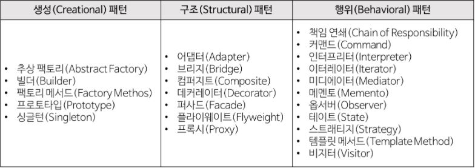

# 디자인 패턴 (Design Pattern)

:writing_hand: *Assembled by Yunju Jang*

🤝*Contributors : JiYoung-Kwon, JiYe Bae*

## Design Pattern

- <b>디자인 패턴이란?</b>

  - 소프트웨어를 설계할 때 <mark>공통으로 자주 발생하는 문제</mark>들이 다시 발생했을 때 <mark>재사용</mark>할 수 있는 설계 방법을 정리한 패턴이다.

  - 디자인 패턴을 참고하여 개발할 경우, 개발의 효율성과 유지보수성, 운용성이 높아지며 프로그램의 최적화에 도움이 된다.

    >"바퀴를 다시 발명하지 마라"
    >
    >- 이미 만들어져서 잘 되는 것을 처음부터 다시 만들 필요가 없다는 의미이다.

  - <b>패턴</b>

    - 각기 다른 소프트웨어 모듈이나 기능을 가진 다양한 응용 소프트웨어 시스템들을 개발할 때에도 서로 간에 공통되는 설계 문제가 존재하며 이를 처리하는 해결책 사이에도 공통점이 있다.
      - 이러한 유사점을 패턴이라고 한다.
    - 패턴은 공통의 언어를 만들어주며 팀원 사이의 의사 소통을 원할하게 해주는 아주 중요한 역할을 한다.

 

 

- <b>디자인 패턴의 구조</b>

  - 콘텍스트 (context)

    - 문제가 발생하는 여러 상황을 기술한다. 즉, 패턴이 적용될 수 있는 상황을 나타낸다.
    - 경우에 따라 패턴이 유용하지 못한 상황을 나타내기도 한다.

     

  - 문제 (problem)

    - 패턴이 적용되어 해결될 필요가 있는 여러 디자인 이슈들을 기술한다.
    - 이 때 여러 제약 사항과 영향력도 문제 해결을 위해 고려해야 한다.
  
     

  - 해결 (solution)

    - 문제를 해결하도록 설계를 구성하는 요소들과 그 요소들 사이의 관계, 책임, 협력 관계를 기술한다.
  - 해결은 반드시 구체적인 구현 방법이나 언어에 의존적이지 않으며, 다양한 상황에 적용할 수 있는 일종의 템플릿이다.

 

 

- <b>디자인 패턴의 종류</b>

  <b>GoF 디자인 패턴</b>

  23가지의 디자인 패턴을 정리하고, 각각의 패턴을 3가지로 분류

  

   

  - <b>생성 패턴 (Creational)</b>

    > 객체 생성에 관련된 패턴
    >
    > 객체의 생성과 조합을 캡슐화하여 특정 객체가 생성되거나 변경되어도 프로그램 구조에 영향을 크게 받지 않도록 유연성을 제공한다.

    1. 싱글톤 패턴

       - 클래스의 인스턴스가 하나임을 보장하고, 접근할 수 있는 전역적인 접근점을 제공하는 패턴으로, 가장 많이 알려져 있다.
       - 인스턴스가 하나뿐이기 때문에 불필요한 메모리 낭비를 최소화할 수 있다.

        

    2. 추상 팩토리 패턴

       - 구체적인 클래스를 지정하지 않고 관련성이 있거나 독립적인 객체들을 생성하기 위한 인터페이스를 제공하는 패턴이다.
       - 연관된 서브 클래스를 묶어 한 번에 교체 가능하다.

        

    3. 빌더 패턴

       - 복한 객체의 생성 과정과 표현 과정을 분리시켜 동일한 생성 과정에서 다양한 표현을 생성할 수 있는 패턴이다.
       - 동일한 객체 생성에서도 다른 결과가 나올 수 있다.

        

    4. 팩토리 메서드 패턴

       - 객체를 생성하는 인터페이스를 정의하지만, 인스턴스를 만드는 클래스는 서브 클래스에서 결정하도록 하는 패턴이다.
       - 캡슐화하는 패턴

   

   

  - <b>구조 패턴 (Structural)</b>

    > 클래스나 객체를 조합해 더 큰 구조를 만드는 패턴
    >
    > ex) 서로 다른 인터페이스를 지닌 2개의 객체를 묶어 단일 인터페이스로 제공,
    >
    > 서로 다른 객체들을 묶어 새로운 기능을 제공

    1. 적응자 패턴 (Adapter or Wrapper)

       - 클래스의 인터페이스를 사용자가 기대하는 다른 인터페이스로 변환하는 패턴
       - 호환성이 없는 인터페이스 때문에 함께 동작할 수 없는 클래스들이 함께 작동하도록 한다.

        

    2. 프록시 패턴

       - 어떤 다른 객체로 접근하는 것을 통제하기 위해 그 객체의 매니저 또는 자리 채움자를 제공하는 패턴

   

   

  - <b>행위 패턴 (Behavioral)</b>

    > 객체나 클래스 사이의 알고리즘이나 책임 분배에 관련된 패턴
    >
    > 한 객체가 혼자 수행할 수 없는 작업을 여러 개의 객체로 어떻게 분배하는지, 그러면서도 객체 사이의 결합도를 최소화하는 것에 중점을 두는 것이다.

    1. 옵저버 패턴 (Observer)
       - 객체들 사이에 1:N의 의존 관계를 정의하여 어떤 객체의 상태가 변할 때, 의존 관계에 있는 모든 객체들이 통지 받고 자동으로 갱신될 수 있게 만드는 패턴이다.
       - 시스템 간 이벤트를 생성하고 수신할 때 사용한다.
       - 변화를 지켜보고 알려주는 것이다.

     

    2. 상태 패턴 (State)
       - 객체의 내부 상태가 변경될 때 행동을 변경하도록 허락한다.
       - 객체는 자신의 클래스가 변경되는 것 처럼 보이게 된다.
       - 객체의 상태에 따라 동일한 동작을 다르게 처리해야 할 때 사용한다.
       - 객체 상태를 캡슐화하고 이를 참조한다.
       - 상태에 따라 다른 방법을 사용한다.

     

    3. 전략 패턴 (Strategy)
       - 동일 계열의 알고리즘들을 정의하고, 각각 캡슐화하며 이들을 상호 교환이 가능하도록 만드는 것이다.
       - 알고리즘을 사용하는 사용자로부터 독립적으로 알고리즘이 변경될 수 있또록 하는 패턴이다.

 

 

 

## 예상질문❔

Q1) 디자인 패턴이란 무엇인가?

A1) 공통으로 발생하는 문제나 그 해결 방법을 정리한 패턴으로, 재사용에 필요한 설계 방법이다.

 

 

### Reference📖

- https://github.com/fake-developers/1st/blob/main/BJY/%EB%94%94%EC%9E%90%EC%9D%B8%ED%8C%A8%ED%84%B4.md
- https://github.com/fake-developers/1st/blob/main/KJY/%5BSW%5D%20%EB%94%94%EC%9E%90%EC%9D%B8%20%ED%8C%A8%ED%84%B4.md