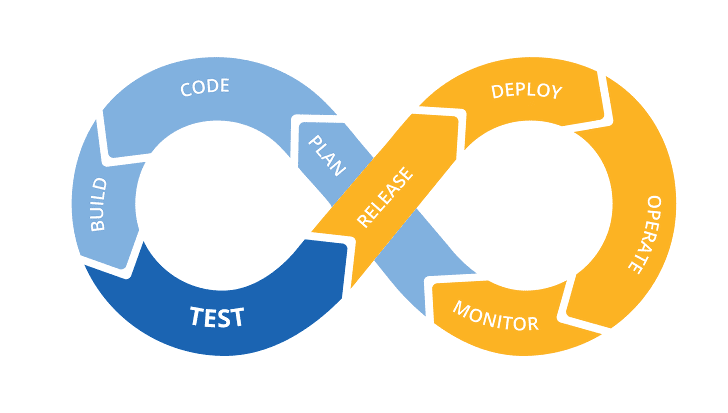

# DevOps

:writing_hand: *Assembled by Yunju Jang*

<!--🤝*Contributors : JeongHea Shin, JiYe Bae*-->

## DevOps

- <b>DevOps 란?</b>

  - 개발 (Dev) 과 운영 (Ops) 의 합성어로, 기존의 개발 업무와 관리 업무로 나누어진 두 역할 사이의 커뮤니케이션, 협업, 통합을 강조하는 개념이다.
  - 개발, IT 운영, 품질 엔지니어링, 보안 등 이제껏 서로 단절되었던 역할들이 서로 조율하고 협업하여 더욱 안정적이고 뛰어난 제품을 생산할 수 있도록 지원한다.
  - 고객 요구 사항에 보다 효과적으로 대응하고 더욱 안심하고 애플리케이션을 빌드하며 비즈니스 목표를 더 빨리 달성할 수 있다.
  - 개발자들과 Ops 들을 서로 잘 융합시키고 의사 소통이 원할하게 하기 위한 개발 방법론이다.

  

 

 

- <b>DevOps의 이점</b>

  - 빠른 속도와 빠른 시장

    - 최근 IT 트렌드의 핵심 요소는 속도로, 일정한 주기를 가지고 끊임없이 결과물을 만들어 내어 그때그때 필요한 요소를 진행하는 방법론이 대두되고 있다.
    - 결국 빠르게 변하는 비즈니스 환경과 사용자의 요구 사항에 기민하게 대처하고, 비즈니스가 계속 살아남기 위해 필요한 것이다.

     

  - Developer와 Operator의 차이

    - 서비스를 만드는 개발자와 이를 운영하고 개선하는 시스템 관리자
    - 서로 간의 역할이 분명하게 나뉘어 있지만, 서로간 협업이 매우 중요하다.
    - 서로 간의 업무와 정보가 손쉽게 공유되지 않아 처리 속도도 매우 느리며, 화합하지 못하는 경우도 빈번하다.
    - 그렇기 때문에 두 역할 간 커뮤니케이션, 협업, 통합을 강조하여 서로 간의 차이를 줄여주는 DevOps가 필요하다.

     

  - 기술의 진화

    - DevOps를 가능하게 하는 요소 중, <mark>자동화</mark>는 서로 간의 업무와 정보를 쉽게 공유할 수 있는 기반이 된다.
    - 개발자가 각각 개발한 소스 코드를 모아서 한번에 빌드하는 통합 빌드의 과정을 특정 시점이 아니라 주기적으로 수행한다.
      - 통합에서 발생하는 오류를 사전에 해결하고 이 모든 과정에 소요되는 시간을 줄이기 위한 것
    -  소프트웨어가 거대해지고 복잡해지면서 팀 단위로 개발을 하게 되었고, 그 과정에 있어 분업과 협업은 필수적이다.
    - 이러한 기술의 진화로 배포를 위한 빌드 단계, 테스팅 단계 등에서 시간을 절약하는 효과를 발휘하여 빠른 시장 변화 속도에 발맞춰 대응할 수 있는 것이 가능하게 되었다.

 

 

- <b>DevOps의 주요 요소</b>

  - <b>문화 (Culture)</b>
    - DevOps 문화는 한 마디로 협업!
    - Dev과 Ops는 모든 도구, 자동화 시스템과 협력한다.
    - 도구의 문제가 아닌, 사람 간의 문제를 해결한다.

   

  - <b>자동화 (Automation)</b>
    
    - 개발, 테스트 및 지속적 배포의 핵심 요소
    
    - 개발 사이클 상에서 높은 수준의 자동화를 도입하면 막대한 이익을 얻을 수 있다.
    
    - 자동화를 처음 접하는 팀은 보통 CD (Continuous Delivery) 로 시작한다.
    
      > CD (Continuous Delivery)
      >
      > - 지속적 배포
      > - 자동화 테스트를 통해 각 코드 변경 사항을 실행한 다음, 빌드를 패키징하고, 자동화 배포를 사용하여 생산을 추진하는 과정이다.
    
    - 이러한 자동화 과정을 통해 더 안정적일 뿐만 아니라 위험도 줄일 수 있다.
    
    - Dev와 Ops 간 서로 업데이트한 내용을 자동화하여 봄으로써 즉각적으로 서로 간의 소통이 가능하다.
  
   
  
  - <b>간소화 (Lean)</b>
    - 낭비를 제거함으로 어떻게 고객에게 가치를 빠르게 제공할 수 있을까에 대한 생각이자 사고 방식이다.
    - DevOps 상에서는 이러한 낮은 가치를 지닌 것을 끊임없이 찾고 지속적으로 개선하는 것이다.
  
   
  
  - <b>측정 (Measurement)</b>
    - DevOps는 여러가지를 측정하고, 측정 결과를 가시화하여 보여준다.
    - 실질적인 데이터를 보여줌으로써 지속적인 개선을 위한 노력이, 실제 개선으로 이어지고 있는지 확인할 수 있따.
    - 즉, 성공적인 측정을 통해 성공적인 피드백을 하고, 이렇게 얻은 정보를 토대로 로드맵을 작성하고, 다음 계획을 세부적으로 수립할 때 사용한다.
    - 이 모든 것은 다른 팀, 다른 부서와의 공유를 통해 더욱 강력한 힘을 발휘한다.
  
   
  
  - <b>공유 (Share)</b>
    - 성공 여부와 상관없이 DevOps는 다른 사람들이 배울 수 있도록 서로의 경험을 공유한다.
    - Dev와 Ops 간의 마찰은 주로 공유의 부족으로 인해 발생한다.
    - 하지만 DevOps 를 통해 서로 간의 경계를 허물어 공유를 통해 피드백 채널을 열어 지속적인 개선을 할 수 있다.

 

 

 

## 예상질문❔

Q1) DevOps란 무엇인가?

A1) 기존의 개발 업무와 관리 업무로 나누어진 두 역할 사이의 커뮤니케이션, 협업, 통합을 강조하는 개념이다.

 

 

### Reference📖

- https://simsimjae.medium.com/devops%EB%9E%80-%EB%AC%B4%EC%97%87%EC%9D%B8%EA%B0%80-c50f4d86666b
- https://azure.microsoft.com/ko-kr/overview/what-is-devops/
- https://wnsgml972.github.io/devops/2019/02/19/devops/