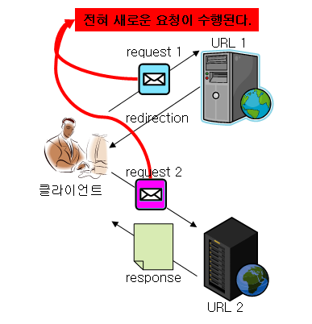
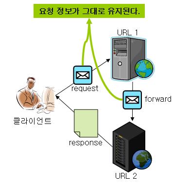

# Forward와 Redirect

:writing_hand: *Assembled by Yunju Jang*

<!--🤝*Contributors : JiYe Bae*-->

<hr>


#### +) 참고 

- <b>Forward와 Redirect</b>

  - JSP 환경에서 현재 작업중인 페이지에서 다른 페이지로 이동하는 두 가지 방식의 페이지 전환 기능이다.

  - redirect 예시

    1. 고객 (클라이언트) 가 고객센터로 상담원 (서버) 에게 123 번 (URL) 으로 전화를 건다.
    2. 상담원은 고객에게 '고객님, 해당 문의 사항은 124번으로 다시 문의 주시겠어요?' 라고 한다.
    3. 고객은 다시 124번으로 문의하여 일을 처리한다.

    <br/>

  - forward 예시

    1. 고객이 고객센터로 상담원에게 123번으로 전화를 건다.
    2. 상담원은 해당 문의사항에 대해 잘 알지 못해 옆의 다른 상담원에게 해당 문의사항에 답을 얻는다.
    3. 상담원은 고객에게 문의사항을 처리해준다.

<br/>

<br/>

## Redirect

- <b>redirect 방식의 특징</b>

  

  - web container는 redirect 명령이 들어오면 웹 브라우저에게 다른 페이지로 이동하라는 명령을 내린다.
    - 첫번째 사례의 경우, 고객은 전화를 끊고 124번으로 다시 전화를 건다.
  - 웹 브라우저는 URL을 지시된 주소로 바꾸고 그 주소로 이동한다.
  - 다른 web container에 있는 주소로 이동한다. (123 -> 124)
    - 클라이언트에서 새로운 로케이션에 대해 요청을 하기 때문에, Web Container 내부에서 자원을 공유할 수 없다.
      - 공유하려면 QueryString을 생성해야 한다.
  - <b>새로운 페이지에서는 request, response 객체가 새롭게 생성된다.</b>
    - 123번에서 고객이 요청했던 문의사항은 사라지고 124번으로 다시 걸어 요청한 문의사항을 다시 말해야한다.

<br/>

<br/>


## Forward

- <b>forward 방식의 특징</b>

  
  
  - web container 차원에서의 페이지 이동이다. (Web Container 내에서 이동)
  - 실제로 웹 브라우저는 다른 페이지로 이동했는지 알 수 없다. 
    - 두번째 사례의 경우, 고객은 상담원이 누구한테 물어봤는지 알 수 없다.
  - 웹 브라우저에는 최초 호출한 URL만 표시되고, 이동한 페이지의 URL 정보는 볼 수 없다.
    - 두번째 사례의 경우, 고객은 123번으로만 전화했기 때문에 알 수 없다.
  - 클라이언트와 통신 없이, 서버에서만 처리된다.
    - 클라이언트 입장에서는 한 번의 요청으로 결과물을 받아볼 수 있다.
    - redirect보다 나은 성능을 보여준다.
  - <b>현재 실행중인 페이지와 forward에 의해 호출될 페이지는 request, response 객체를 공유한다.</b>
    - 고객이 요청한 문의 사항은 고객이 전화를 끊을 때까지 유효하다.
  - WAS의 서블릿/JSP가 요청을 받은 후 처리하다가, 추가적인 처리를 같은 웹 애플리케이션 안에 포함된 다른 서블릿/JSP에게 위임하는 경우
  
  <br/>

<br/>

<br/>

## Redirect 와 Forward 차이

- <b>URL의 변화 여부</b>
- redirect : 변화 있음
  - forward : 변화 없음

<br/>

- <b>객체의 재사용 여부</b>
  - redirect : 재사용하지 않음
  - forward : 재사용

<br/>

<br/>

- <b>각 방식의 적용 사례</b>

  - 글쓰기 기능을 수행 시, 응답 페이지는 forward vs redirect 
    - 정답 - redirect
      - forward의 경우 요청 정보가 그대로 살아있기 때문에, 똑같은 글이 여러번 등록될 수 있다.
      - redirect의 경우 처음 글을 작성할 때 보냈던 요청정보는 존재하지 않는다.
      - 또한, 글쓰기 기능을 하는 URL1이 아닌 URL2로 요청 보내기 때문에 글쓰기가 여러번 수행되지 않는다.

  <br/>

  - 시스템 (Session 또는 DB 등)에 변화가 생기는 요청의 경우 redirect가 바람직하다.
    - ex) 로그인, 회원가입, 글쓰기
  - 시스템에 변화가 생기지 않는 단순조회 (리스트보기, 검색)의 경우 forward 방식으로 응답하는 것이 바람직하다.

  <br/>

  - Spring 예시

    ``` java
    @Controller
    @RequestMapping("/board") // 게시판 기능
    public class BoardController{
        @Resource(name="boardService")
        private BoardService boardService;
        
        @PostMapping(value="/insertBoardInfo") // 게시판에 글 추가
        public String isnertBoardInfo(HttpServletRequest request, @ModelAttribute BoardVO boardVO) throws Exception{
            int rsCnt = boardService.insertBoardInfo(request, boardVO);
            if(rsCnt < 1){
                return "/cmmn/error"; // 추가할 게 없으면 에러 페이지
            }
            return "redirect:/board/retrieveBoardList"; // /board/insertBoardInfo에서 /board/retrieveBoardList로 리다이렉트
        }
        
        @GetMapping(value="/retrieveBoardList")
        public String retrieveBoardList(Model model) throws Exception {
            List boardList = boardService.retrieveBoardList();
            model.addAttribute("boardList", boardList);
            return "/board/boardListView";
        }
    }
    ```

    


<br/>

<br/>

## 예상질문❔

Q1) redirect 방식이란 무엇인가?

A1) URL을 지시된 주소로 바꾸고 해당 주소로 이동한다.

<br/>

Q2) forward 방식이란 무엇인가?

A2) 웹 브라우저에 최초 호출한 URL이 표시되고, 이동한 페이지의 URL 정보는 알 수 없다.

<br/>

<br/>

### Reference📖

- https://doublesprogramming.tistory.com/63
- https://mangkyu.tistory.com/51
- https://goodncuteman.tistory.com/58