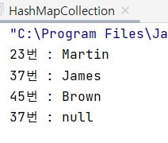
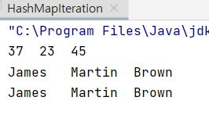
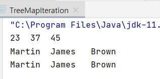

# Java - Collection Framework (HashMap ,TreeMap)

:writing_hand: *Assembled by Yunju Jang*

<!-- 🤝*Contributors : Jeonghea Shin* -->

<hr>


### Map\<K, V> 인터페이스를 구현하는 컬렉션 클래스들

- Map <K, V>를 구현하는 컬렉션 클래스의 인스턴스들은 Key와 Value가 한 쌍을 이루는 형태로 데이터를 저장한다.
  - Value를 저장할 때, 이를 찾을 때 사용하는 Key를 함께 저장하는 구조이다.
  - Key는 중복될 수 없고, Value는 중복 되어도 상관이 없다.
- Map <K, V>를 구현하는 대표 클래스로 HashMap <K, V>와 TreeMap <K, V>가 있다.
  - 트리 자료구조를 기반으로 구현된 TreeMap <K, V>은 <mark>정렬 상태</mark>를 유지한다는 것이 둘의 가장 큰 차이이다.
  - 이 때 정렬 대상은 Key이다.

<br/>

<br/>

#### HashMap <K, V>

- <b>HashMap <K, V> 사용 예</b>

  ```Java
  import java.util.HashMap;
  
  public class HashMapCollection {
      public static void main(String[] args){
          HashMap<Integer, String> map = new HashMap<>();
  
          // Key-Value 기반 데이터 저장
          map.put(45, "Brown");
          map.put(37, "James");
          map.put(23, "Martin");
  
          // 데이터 탐색
          System.out.println("23번 : " + map.get(23));
          System.out.println("37번 : " + map.get(37));
          System.out.println("45번 : " + map.get(45));
  
          // 데이터 삭제
          map.remove(37);
  
          // 데이터 삭제 확인
          System.out.println("37번 : " + map.get(37));
      }
  }
  ```

  - 실행 결과

    

    - HashMap <K, V> 클래스는 Iterable\<T> 인터페이스를 구현하지 않으니 for-each 문을 통해서, 혹은 '반복자'를 얻어서 순차적 접근을 진행할 수 없다.
    - 대신에 Map<K, V>에는 <code>public Set\<K> keySet()</code> 메소드가 존재한다.
      - 이 메소드는 Set\<E>를 구현하는 컬렉션 인스턴스를 생성하고, 여기에 모든 Key를 담아 반환한다.
      - 이 메소드를 통해 Key를 따로 모으고, 이를 통한 순차적 접근을 진행할 수 있다.
    
    > +) 참고
    >
    > <b>Iterator 란? </b>
    >
    > - 자바의 컬렉션 프레임워크에서 컬렉션에 저장되어 있는 요소들을 읽어오는 방법을 표준화한 것이다.
    > - 집합체를 다룰 때는 개별적인 클래스에 대해 데이터를 읽는 방법을 알아야 하기 때문에 각 컬렉션에 접근이 힘들어진다.
    >   - 그러나 Iterator를 쓰게 되면 어떤 컬렉션이든 동일한 방식으로 접근이 가능하여 그 안에 있는 항목들에 접근할 수 있는 방법을 제공한다. (다형성)
    > - Iterator 메소드에는 hasNext(), next(), remove()가 있다.
    >   - hasNext() : 읽어올 요소가 남아있는지 확인, true, false 반환
    >   - next() : 다음 데이터 반환
    >   - remove() : next()로 읽어온 요소를 삭제

  <br/>

  - HashMap <K, V>의 순차적 접근 예제

    ```java
    import java.util.HashMap;
    import java.util.Iterator;
    import java.util.Set;
    
    public class HashMapIteration {
        public static void main(String[] args) {
            HashMap<Integer, String> map = new HashMap<>();
    
            // Key-Value 기반 데이터 저장
            map.put(45, "Brown");
            map.put(37, "James");
            map.put(23, "Martin");
    
            // Key 만 담고 있는 컬렉션 인스턴스 생성
            Set<Integer> ks = map.keySet();
    
            // 전체 Key 출력 (for-each문 기반)
            for(Integer n: ks)
                System.out.print(n.toString() + '\t');
            System.out.println();
    
            // 전체 Value 출력 (for-each문 기반)
            for(Integer n : ks)
                System.out.print(map.get(n).toString() + '\t');
            System.out.println();
    
            // 전체 Value 출력 (반복자 기반)
            for(Iterator<Integer> itr = ks.iterator(); itr.hasNext();)
                System.out.print(map.get(itr.next()) + '\t');
            System.out.println();
        }
    }
    
    ```

    

    - <code>Set\<Integer> ks = map.KeySet();</code>
      - Set\<E>는 Iterable\<E>을 상속하므로 예제에서 보이듯 위의 문장 실행 이후 for-each문을 통해, 또는 반복자를 얻어 순차적 접근을 진행할 수 있다.

<br/>

<br/>

<br/>

#### TreeMap <K, V>

- <b>TreeMap <K, V> 사용 예</b>

  - 트리 자료구조를 기반으로 구현되어 있어 정렬 상태를 유지한다.

  - 이전 예제에서 컬렉션 클래스만 TreeMap <K, V>로 바꾸어 실행

    ```java
    import java.util.Iterator;
    import java.util.Set;
    import java.util.TreeMap;
    
    public class TreeMapIteration {
        public static void main(String[] args) {
            TreeMap<Integer, String> map = new TreeMap<>();
            // ~~~ 위와 동일 
        }
    }
    ```

  

  - Key에 해당하는 나이 정보가 오름차순으로 출력되었다.
  - 반복자는 오름차순으로 Key에 접근한다.

  

<br/>

<br/>

## 예상질문❔

Q1) HashMap <K, V> 클래스는 무엇인가?

Q2) Map <K, V>를 구현하는 대표적인 컬렉션 클래스로, 해쉬 알고리즘을 기반으로 구현되어 있다. 인스턴스들은 Key와 Value가 한 쌍을 이루는 형태로 데이터를 저장한다.

<br/>

Q2) TreeMap <K, V> 클래스는 무엇인가?

A2) Map <K, V>를 구현하는 대표적인 컬렉션 클래스로, 트리 알고리즘을 기반으로 구현되어 있어 정렬 상태를 유지한다는 특징이 있다.

<br/>

<br/>

### Reference📖

- https://thefif19wlsvy.tistory.com/41
- 도서) 윤성우의 열혈 Java 프로그래밍 Chapter 23. 컬렉션 프레임워크 1
